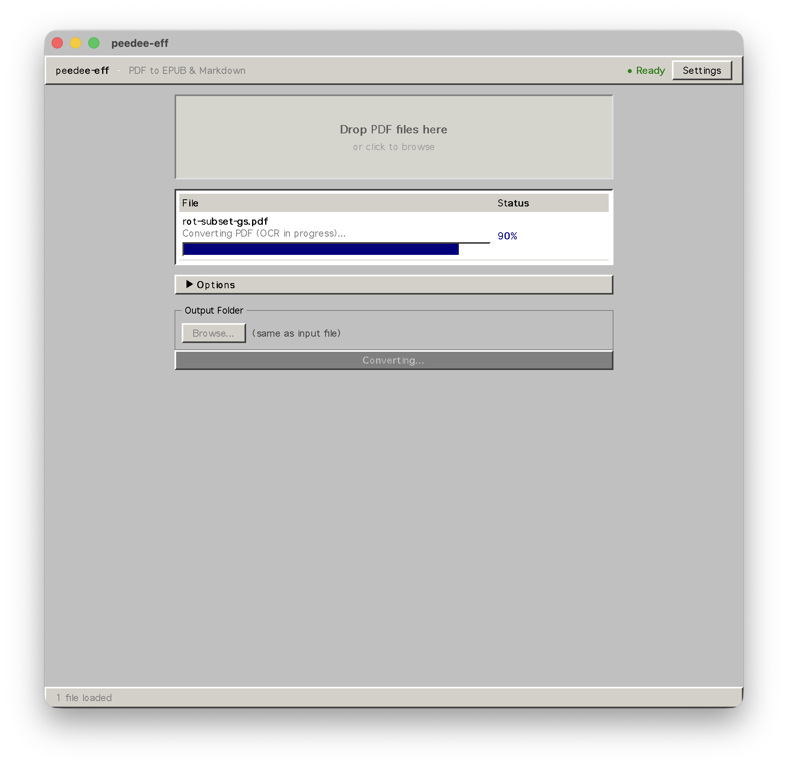

# peedee-eff

Desktop app that converts scanned/image PDFs into EPUBs and Markdown files. Runs OCR locally on your machine — nothing leaves your computer.



## What it does

Drop a PDF in, get an EPUB and/or Markdown file out. It uses [Marker](https://github.com/VikParuchuri/marker) for OCR under the hood, which handles text, images, equations (rendered as MathML in the EPUB), and document structure.

## How to build

You need: Rust, bun, Python 3.10+, uv.

```bash
# Frontend deps
bun install

# Python sidecar deps
cd sidecar && uv sync && cd ..

# Run
bun tauri dev
```

On first launch the app will download OCR models (~2.5 GB). This only happens once.

## Stack

- **Tauri v2** — Rust backend, native macOS window
- **React + TypeScript** — frontend, served by Vite in dev
- **Python sidecar** — does the actual OCR and EPUB building, talks to Tauri over stdin/stdout JSON
- **Marker** — the OCR engine (wraps surya)
- **ebooklib** — EPUB construction
- **latex2mathml** — equation rendering

## Project layout

```
src/              React frontend
src-tauri/        Rust backend (Tauri commands, sidecar management)
sidecar/          Python OCR + EPUB builder
  engines/        OCR engine interface + implementations
  builders/       EPUB/Markdown output builders
  tests/          pytest suite
```

## Tests

```bash
cd sidecar && uv run python -m pytest tests/ -v   # Python (18 tests)
cd src-tauri && cargo test                          # Rust integration
npx tsc --noEmit                                    # TypeScript
```

## Status

Works. macOS only (Apple Silicon). Not yet packaged as a .dmg.
